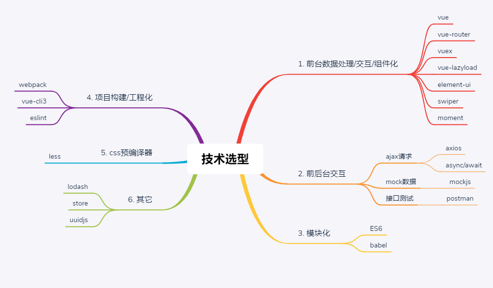
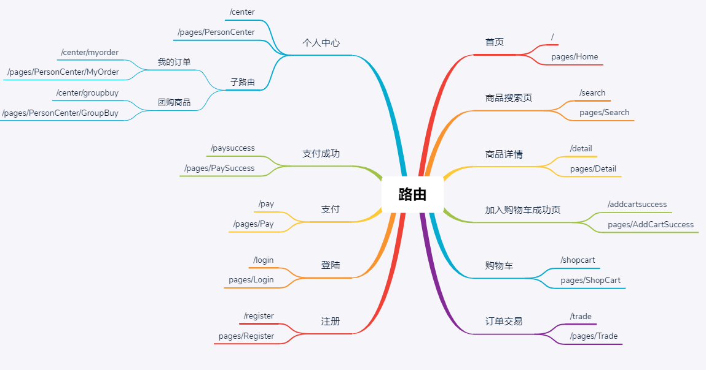
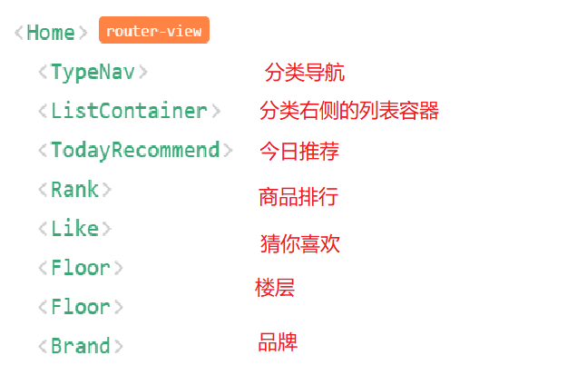

# SPH_Project_01
## setup
```
# 克隆项目
https://github.com/laiba345/SPH_Project_01.git
# 进入项目目录
cd SPH_Project_01
# 安装依赖
npm install ｜ npm install --registry=https://registry.npm.taobao.org（淘宝镜像）
# 启动服务
npm run serve
```

## 项目描述
1. 此项目为在线电商Web App (SPA)
2. 包括首页, 搜索列表, 商品详情, 购物车, 订单, 支付, 用户登陆/注册等多个子模块
3. 使用Vue全家桶+ES6+Webpack+Axios等前端最新最热的技术
4. 采用模块化、组件化、工程化的模式开发

## 项目功能界面


## 技术选型


## 前端路由


## API接口


## 你能从项目中学到什么？
### 1、流程及开发方法
1. 熟悉一个项目的开发流程
2. 学会模块化、组件化、工程化的开发模式
3. 掌握使用vue-cli脚手架初始化Vue.js项目
4. 学会模拟json后端数据，实现前后端分离开发
5. 学会ES6+eslint的开发方式
6. 掌握一些项目优化技巧

### 2、Vue插件或第三方库
1. 学会使用vue-router开发单页应用
2. 学会使用axios与后端进行数据交互
3. 学会使用vuex管理应用组件状态
4. 学会使用swiper实现页面滑动效果
5. 学会使用elment-ui组件库构建界面
6. 学会使用vue-lazyload实现图片惰加载
7. 学会使用mockjs模拟后台数据接口

## 开启项目开发
### 使用Vue cli3（脚手架）搭建项目
1. Vue CLI是vue官方提供的用于搭建基于vue+webpack+es6项目的脚手架工具
2. 操作
```
npm install -g @vue/cli
```
3. 项目源码目录设计

### 引入vue-router
**下载依赖包**
```
npm install -S vue-router
```
### Vue组件化
1. 配置vue组件文件模板
2. App.vue
3. main.js
4. jsconfig.json(让vscode提示@开头的模块路径引入)
```
{
  "compilerOptions": {
    "baseUrl": "./",
    "paths": {
        "@/*": ["src/*"] //！！
     }
  },
  "exclude": ["node_modules", "dist"]
}
```
## Header组件（原始的组件都需要进行组件拆分工作）

### router/routes.js
**问题：如何实现params参数可传可不传？**
```
{
 path: '/search/:keyword?', // params参数可传可不传
    component: Search
},
```
## Search组件编码
```
<div>搜索关键字: {{$route.params.keyword}}</div>
```

## 路由跳转与传参相关问题
**一、路由跳转的两种基本方式**
```
1. 声明式: <router-link to="">
2. 编程式: this.$router.push()/replace()
```
**二、跳转路由携带参数的两种方式**
```
1、params参数
2、query参数
```
### 面试问题
**面试问题1** ～ 编程式路由跳转到当前路由(参数不变), 会抛出NavigationDuplicated的警告错误
1. 解决1: 在跳转时指定成功或失败的回调函数, 通过catch处理错误
2. 解决2: 修正Vue原型上的push和replace方法 (优秀)

**面试问题2** ～ 如何指定params参数可传可不传？
解释：如果路由要求传递params参数，但是你就不传递params参数，发现一件事情，**url会出现问题**
如何指定params参数可以传递或者不传递-> 在配置路由的时候，在占位的后面加上一个问号 ？，【params可以传递或者不传递】
```
path:'/search/:keyword?'
```

**面试问题3** ～ 指定params参数时可不可以用path和params配置的组合？
回答：不可以用path和params配置的组合, 只能用name和params配置的组合
     query配置可以与path或name进行组合使用
解释：路由跳转传参的时候，对象的写法可以是name，path形式，但是需要注意的是，path这种写法不能与params参数一起使用
```
this.$router.push({
        path:'/search', 
        params:{
            keyWord:this.keyWord, 
        }, 
        query:{
            k:this.keyWord.toUpperCase()
        }
    })
```

**面试问题4** ～ 如果指定name与params配置, 但params中数据是一个"", 无法跳转？
1. 解决1: 不指定params
2. 解决2: 指定params参数值为undefined
```
this.$router.push({
        name: "search",
        params:{keyWord:'' || undefined}, 
        query: { k: this.keyWord.toUpperCase() },
    });
```

**面试问题5** ～ 路由组件能不能传递props数据?
1. 可以
2. 可以将query或且params参数映射/转换成props传递给路由组件对象
3. 实现
```
props: (route)=>({keyword1:route.params.keyword, keyword2: route.query.keyword })
```

### 解决路由跳转时的NavigationDuplicated错误?
1. 问题描述：编程式路由跳转到当前路径且参数没有变化时会抛出 NavigationDuplicated 错误
2. 原因分析：vue-router3.1.0之后, 引入了push()的promise的语法, 如果没有通过参数指定回调函数就返回一个promise来指定成功/失败的回调, 且内部会判断如果要跳转的路径和参数都没有变化, 会抛出一个失败的promise
3. 解决（在router文件夹下的index.js中进行方法的重写）
```                      
注意:编程式导航（push|replace）才会有这种情况的异常，声明式导航是没有这种问题，因为声明式导航内部已经解决这种问题。
这种异常，对于程序没有任何影响的。
为什么会出现这种现象:
由于vue-router最新版本3.5.2，引入了promise，当传递参数多次且重复，会抛出异常，因此出现上面现象,
第一种解决方案：是给push函数，传入相应的成功的回调与失败的回调
第一种解决方案可以暂时解决当前问题，但是以后再用push|replace还是会出现类似现象，因此我们需要从‘根’治病；

// 先把VueRouter原型对象的push，先保存一份
let originPush = VueRouter.prototype.push
let originReplace = VueRouter.prototype.replace

// 重写push | replace
// 第一个参数，告诉原来的push方法，你往哪里跳转，以及传递哪些参数
// 第二个参数，成功的回调，
// 第三个参数，失败的回调
VueRouter.prototype.push = function (location, resolve, reject) {
  if (resolve && reject) {
    /* 
      call || apply 区别
      相同点：都可以调用函数一次，都可以篡改函数的上下文一次
        都可以更改函数的上下文一次
      不同点：call与apply传递参数，call传递参数用逗号隔开，apply方法执行，传递数组
    */
    originPush.call(this, location, resolve, reject)

  } else {
    originPush.call(this, location, () => { }, () => { })
  }
}

VueRouter.prototype.replace = function (location, resolve, reject) {
  if (resolve && reject) {
    /* 
      call || apply 区别
      相同点：都可以调用函数一次，都可以篡改函数的上下文一次
      不同点：call与apply传递参数，call传递参数用逗号隔开，apply方法执行，传递数组
    */
    originReplace.call(this, location, resolve, reject)
  } else {
    // 有的话，我们就使用resolve | reject，没有的话，我们使用的就是自己书写的回调函数
    originReplace.call(this, location, () => { }, () => { })
  }
}
```
### 引入Less预编译器
1. 下载依赖包
```
npm install -D less less-loader
```
2. 组件中使用less
```
<style lang="less" scoped>
</style>
```

## Footer组件
### 控制Footer组件的显示/隐藏
1. 解决方案：利用路由的meta配置和v-show
```
rooter/routes.js
{
  path: '/register',
  component: Register,
  meta: { // 需要隐藏footer的路由添加此配置
    isHideFooter: true
  }
},
```
2. 在App.vue中进行显示与隐藏
```
<Footer v-show="!$route.meta.isHideFooter"/> 通过$route.来获取相关内容
```
## Home路由组件
### Home静态组件
1. 抽取出完整的静态路由组件

### 从Home组件中抽取子组件（静态的）
1. TypeNav: 3级分类导航
2. ListContainer: 包含轮播列表的容器
3. TodayRecommend: 今日推荐
4. Rank: 排行
5. Like: 猜你喜欢
6. Floor: 楼层
7. Brand: 品牌



## 后台应用
### 说明
1. 咱们的项目是一个前后台分离的项目: 前台应用与后台应用
2. 后台应用负责处理前台应用提交的请求, 并给前台应用返回json数据
3. 前台应用负责展现数据, 与用户交互, 与后台应用交互

### API文档接口
1. 接口不稳定，具体看视频更新

### 使用postman工具测试接口

### 前后台交互ajax
1. 下载依赖包
```
npm install -S axios nprogress
```
2. 封装


   

  
  


