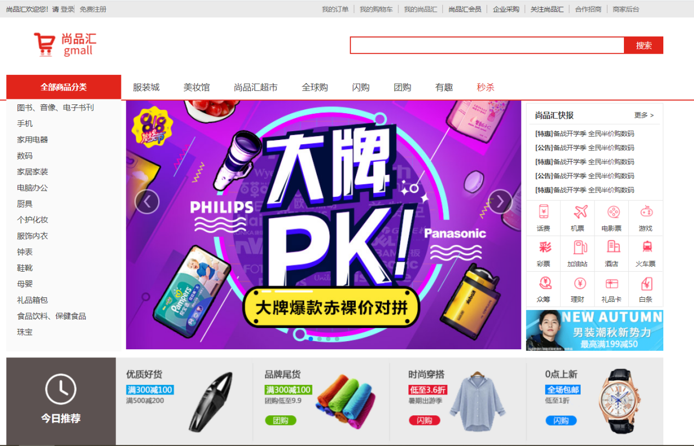
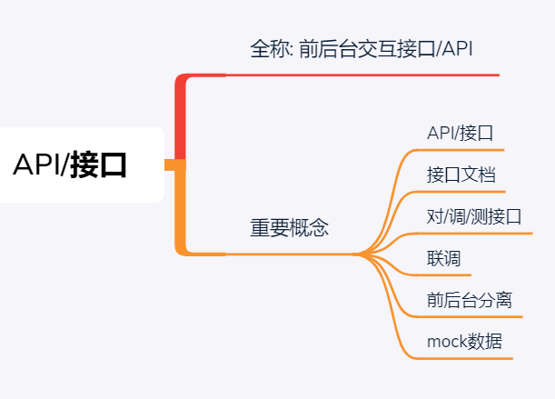

# SPH_Project_01
## setup
```
# 克隆项目
https://github.com/laiba345/SPH_Project_01.git
# 进入项目目录
cd SPH_Project_01
# 安装依赖
npm install ｜ npm install --registry=https://registry.npm.taobao.org（淘宝镜像）
# 启动服务
npm run serve
```

## 项目描述
1. 此项目为在线电商Web App (SPA)
2. 包括首页, 搜索列表, 商品详情, 购物车, 订单, 支付, 用户登陆/注册等多个子模块
3. 使用Vue全家桶+ES6+Webpack+Axios等前端最新最热的技术
4. 采用模块化、组件化、工程化的模式开发

## 项目功能界面


## 技术选型


## 前端路由


## API接口


## 你能从项目中学到什么？
### 1、流程及开发方法
1. 熟悉一个项目的开发流程
2. 学会模块化、组件化、工程化的开发模式
3. 掌握使用vue-cli脚手架初始化Vue.js项目
4. 学会模拟json后端数据，实现前后端分离开发
5. 学会ES6+eslint的开发方式
6. 掌握一些项目优化技巧

### 2、Vue插件或第三方库
1. 学会使用vue-router开发单页应用
2. 学会使用axios与后端进行数据交互
3. 学会使用vuex管理应用组件状态
4. 学会使用swiper实现页面滑动效果
5. 学会使用elment-ui组件库构建界面
6. 学会使用vue-lazyload实现图片惰加载
7. 学会使用mockjs模拟后台数据接口

## 开启项目开发
### 使用Vue cli3（脚手架）搭建项目
1. Vue CLI是vue官方提供的用于搭建基于vue+webpack+es6项目的脚手架工具
2. 操作
```
npm install -g @vue/cli
```
3. 项目源码目录设计

### 引入vue-router
**下载依赖包**
```
npm install -S vue-router
```
### Vue组件化
1. 配置vue组件文件模板
2. App.vue
3. main.js
4. jsconfig.json(让vscode提示@开头的模块路径引入)
```
{
  "compilerOptions": {
    "baseUrl": "./",
    "paths": {
        "@/*": ["src/*"] //！！
     }
  },
  "exclude": ["node_modules", "dist"]
}
```
## Header组件（原始的组件都需要进行组件拆分工作）

### router/routes.js
**问题：如何实现params参数可传可不传？**
```
{
 path: '/search/:keyword?', // params参数可传可不传
    component: Search
},
```
## Search组件编码
```
<div>搜索关键字: {{$route.params.keyword}}</div>
```

## 路由跳转与传参相关问题
**一、路由跳转的两种基本方式**
```
1. 声明式: <router-link to="">
2. 编程式: this.$router.push()/replace()
```
**二、跳转路由携带参数的两种方式**
```
1、params参数
2、query参数
```
### 面试问题
**面试问题1** ～ 编程式路由跳转到当前路由(参数不变), 会抛出NavigationDuplicated的警告错误
1. 解决1: 在跳转时指定成功或失败的回调函数, 通过catch处理错误
2. 解决2: 修正Vue原型上的push和replace方法 (优秀)

**面试问题2** ～ 如何指定params参数可传可不传？
解释：如果路由要求传递params参数，但是你就不传递params参数，发现一件事情，**url会出现问题**
如何指定params参数可以传递或者不传递-> 在配置路由的时候，在占位的后面加上一个问号 ？，【params可以传递或者不传递】
```
path:'/search/:keyword?'
```

**面试问题3** ～ 指定params参数时可不可以用path和params配置的组合？
回答：不可以用path和params配置的组合, 只能用name和params配置的组合
     query配置可以与path或name进行组合使用
解释：路由跳转传参的时候，对象的写法可以是name，path形式，但是需要注意的是，path这种写法不能与params参数一起使用
```
this.$router.push({
        path:'/search', 
        params:{
            keyWord:this.keyWord, 
        }, 
        query:{
            k:this.keyWord.toUpperCase()
        }
    })
```

**面试问题4** ～ 如果指定name与params配置, 但params中数据是一个"", 无法跳转？
1. 解决1: 不指定params
2. 解决2: 指定params参数值为undefined
```
this.$router.push({
        name: "search",
        params:{keyWord:'' || undefined}, 
        query: { k: this.keyWord.toUpperCase() },
    });
```

**面试问题5** ～ 路由组件能不能传递props数据?
1. 可以
2. 可以将query或且params参数映射/转换成props传递给路由组件对象
3. 实现
```
props: (route)=>({keyword1:route.params.keyword, keyword2: route.query.keyword })
```

### 解决路由跳转时的NavigationDuplicated错误?
1. 问题描述：编程式路由跳转到当前路径且参数没有变化时会抛出 NavigationDuplicated 错误
2. 原因分析：vue-router3.1.0之后, 引入了push()的promise的语法, 如果没有通过参数指定回调函数就返回一个promise来指定成功/失败的回调, 且内部会判断如果要跳转的路径和参数都没有变化, 会抛出一个失败的promise
3. 解决（在router文件夹下的index.js中进行方法的重写）
```                      
注意:编程式导航（push|replace）才会有这种情况的异常，声明式导航是没有这种问题，因为声明式导航内部已经解决这种问题。
这种异常，对于程序没有任何影响的。
为什么会出现这种现象:
由于vue-router最新版本3.5.2，引入了promise，当传递参数多次且重复，会抛出异常，因此出现上面现象,
第一种解决方案：是给push函数，传入相应的成功的回调与失败的回调
第一种解决方案可以暂时解决当前问题，但是以后再用push|replace还是会出现类似现象，因此我们需要从‘根’治病；

// 先把VueRouter原型对象的push，先保存一份
let originPush = VueRouter.prototype.push
let originReplace = VueRouter.prototype.replace

// 重写push | replace
// 第一个参数，告诉原来的push方法，你往哪里跳转，以及传递哪些参数
// 第二个参数，成功的回调，
// 第三个参数，失败的回调
VueRouter.prototype.push = function (location, resolve, reject) {
  if (resolve && reject) {
    /* 
      call || apply 区别
      相同点：都可以调用函数一次，都可以篡改函数的上下文一次
        都可以更改函数的上下文一次
      不同点：call与apply传递参数，call传递参数用逗号隔开，apply方法执行，传递数组
    */
    originPush.call(this, location, resolve, reject)

  } else {
    originPush.call(this, location, () => { }, () => { })
  }
}

VueRouter.prototype.replace = function (location, resolve, reject) {
  if (resolve && reject) {
    /* 
      call || apply 区别
      相同点：都可以调用函数一次，都可以篡改函数的上下文一次
      不同点：call与apply传递参数，call传递参数用逗号隔开，apply方法执行，传递数组
    */
    originReplace.call(this, location, resolve, reject)
  } else {
    // 有的话，我们就使用resolve | reject，没有的话，我们使用的就是自己书写的回调函数
    originReplace.call(this, location, () => { }, () => { })
  }
}
```
### 引入Less预编译器
1. 下载依赖包
```
npm install -D less less-loader
```
2. 组件中使用less
```
<style lang="less" scoped>
</style>
```

## Footer组件
### 控制Footer组件的显示/隐藏
1. 解决方案：利用路由的meta配置和v-show
```
rooter/routes.js
{
  path: '/register',
  component: Register,
  meta: { // 需要隐藏footer的路由添加此配置
    isHideFooter: true
  }
},
```
2. 在App.vue中进行显示与隐藏
```
<Footer v-show="!$route.meta.isHideFooter"/> 通过$route.来获取相关内容
```
## Home路由组件
### Home静态组件
1. 抽取出完整的静态路由组件

### 从Home组件中抽取子组件（静态的）
1. TypeNav: 3级分类导航
2. ListContainer: 包含轮播列表的容器
3. TodayRecommend: 今日推荐
4. Rank: 排行
5. Like: 猜你喜欢
6. Floor: 楼层
7. Brand: 品牌


## 后台应用
### 说明
1. 咱们的项目是一个前后台分离的项目: 前台应用与后台应用
2. 后台应用负责处理前台应用提交的请求, 并给前台应用返回json数据
3. 前台应用负责展现数据, 与用户交互, 与后台应用交互

### API文档接口
1. 接口不稳定，具体看视频更新

### 使用postman工具测试接口

### 前后台交互ajax
1. 下载依赖包
```
npm install -S axios nprogress
```
2. 封装ajax请求模块（二次封装）
3. 配置代理（可跨域）
```
devServer: {
    proxy: {
      '/api': {
        // 数据来自于哪一台代理服务器 就使用哪一台代理服务器即可
        target: 'http://gmall-h5-api.atguigu.cn',
      },
    }, 
    host: 'localhost',
    port: 8080
  }
```
### 使用vuex管理状态
1. 下载依赖包
```
npm install -S vuex
```
2. 在每一个需要使用vuex管理数据的模块创建一个文件夹，配置index.js, 最后在通过store文件夹下的index.js向外暴露

3. 注册store: 在main.js文件中
```
import store from './store'

new Vue({
  store, // 注册vuex的store对象  ==> 所有组件对象都有一个$store属性
})
```

### 异步显示分类列表：TypeNav
#### 重难点说明
1)组件与vuex交互
2)事件控制二三级分类列表的显示与隐藏
3)优化高频事件触发处理: 利用lodash进行函数节流处理
4)优化减小打包文件: 对lodash库实现按需引入 
5)解决快速移出后可能显示第一个分类的子分类列表的bug
6)优化减少组件对象数量: 使用编程式导航代替声明式导航
7)优化事件处理效率: 利用事件委托
8)利用标签自定义属性携带动态数据
9)控制一级列表的显示与隐藏
10)一级列表显示隐藏的过渡效果
11)优化请求执行的位置, 减少请求次数
12)合并分类query参数与搜索的关键字params参数

## Mock/模拟数据接口
1. 下载依赖包
```
npm install -S mockjs
```
2. Web应用前后端分离
1)后台向前台提供API接口, 只负责数据的提供和计算，而完全不处理展现
2)前台通过Http(Ajax)请求获取数据,　在浏览器端动态构建界面显示数据

3. 设计JSON数据结构
- 理解JSON数据结构（JSON 可以将 JavaScript 对象中表示的一组数据转换为字符串，然后就可以在函数之间轻松地传递这个字符串，或者在异步应用程序中将字符串从 Web 客户机传递给服务器端程序。）
- 编写模拟JSON数据
- 一个简单的JSON数据模拟
```
{ "people": [

{ "firstName": "Brett", "lastName":"McLaughlin", "email": "aaaa" },

{ "firstName": "Jason", "lastName":"Hunter", "email": "bbbb"},

{ "firstName": "Elliotte", "lastName":"Harold", "email": "cccc" }

]}
```

## 利用Mock接口实现动态的Home
### 重难点说明
1. 使用swiper实现静态页面轮播
2. 解决多个swiper冲突的问题
3. 解决swiper动态页面轮播的bug
4. 定义可复用的轮播组件
5. 解决Floor组件中轮播有问题的bug

### 下载依赖包
```
npm install -S swiper
```
### 通用的轮播组件 components/Carousel
### 首页的ListContainer组件
### 首页的Floor组件
### 上面两个组件配置好了在Home组件中使用

## Search路由
### 重难点说明
1. 搜索查询条件参数理解与准备
2. 组件动态数据显示
3. 根据分类和关键字进行搜索
4. 根据品牌进行搜索
5. 根据属性进行搜索
6. 排序搜索
7. 自定义分页组件

### 接口请求函数（api/index.js）
```
// 请求搜索匹配的商品相关数据
export const reqProductList = (searchParams) => ajax.post('/list', searchParams)
```
### vuex管理搜索模块（store/search/index.js）
- 管理搜索模块中的数据
- 接受保存商品列表相关的数据对象
- 对搜索出来的商品列表相关的数据进行操作

### Search的子组件：属性选择器（pages/Search/SearchSelector）

### 通用的分页组件（Pagination）很多组件都会用到其来进行展示数据列表

### TypeNav组件（商品导航）

### Header组件

### Search路由组件

## 使用阿里图标（iconfont）
1.在线地址: https://www.iconfont.cn/
2.注册并登陆
3.创建一个可以包含需要的所有图标的项目
4.搜索图标并添加到购物车
5.将购物车中的图标添加到指定项目
6.修改图标的名称
7.选择Font class的使用方式, 并点击生成在线样式url
8.在index页面中引入此图标的在线样式链接: 
```
<link rel="stylesheet" href="http://at.alicdn.com/t/font_1766283_dobjk7xxze7.css">
```
9.在组件中使用（可以通过color改变颜色, 通过font-size改变大小）
```
<i class=”iconfont icondown”>
```

## Detail路由
### 重难点说明
1. 图片放大镜效果
2. 小图轮播

### 接口请求函数
```
// 获取商品详情信息
export const reqDetailInfo = (skuId) => ajax.get(`/item/${skuId}`)
``` 
### vuex管理的详情模块

### 商品小图片列表组件（pages/Detail/ImageList）

### 图片放大镜组件（pages/Detail/Zoom）

### Detail路由组件

### 注册Detail路由（router/routes.js)
```
{
  path: '/detail/:skuId',
  component: Detail
},
```

## AddCartSuccess路由
### 重难点说明
1. 区别使用sessionStorage 与 localStorage

### 跳转到此路由
```
/* 
添加到购物车
*/
async addToCart() {
  const { skuId } = this.$route.params
  const {skuNum} = this
  window.sessionStorage.setItem('SKU_INFO', JSON.stringify(this.skuInfo))
  const message = await this.$store.dispatch('addToCart', {skuId,skuNum})
  if (message) { // 有错误message, 提示添加购物失败
    alert(message)
  } else { // 添加购物车成功, 跳转到成功界面
    this.$router.push({
            path: '/addcartsuccess',
        query: {skuNum }
    })
  }
}
```

### AddCartSuccess路由组件

## ShopCart路由
### 重难点说明
1. 用户临时ID的处理
2. 购物车数据的管理(复杂)
3. 不使用v-model监控用户输入
4. async / await / Promise.all() 的使用

### 接口请求函数
```
// 添加到购物车(修改购物项数量)
// skuNum指定为改变的数量, 如果是减少就是负数
export const reqAddToCart = (skuId, skuNum) => ajax.post(`/cart/addToCart/${skuId}/${skuNum}`)
// 获取购物车数据列表
export const reqCartList = () => ajax.get('/cart/cartList')
```

### vuex管理的购物车模块（store/shopCart/index.js）

### 请求携带唯一的用户临时ID
1. 下载工具包
```
npm install uuid store -S
```
2. utils/uuid_token.js
3. store/user/index.js
4. api/ajax.js

### shopCart路由组件

## 注册与登录组件
### 重难点说明
1. 注册/登陆请求后组件的响应处理
2. 登陆后自动携带token数据

### 接口请求函数的书写（api/index.js)

### vuex管理数据

### 工具函数

### 注册路由组件的书写

### 登录路由组件的书写

### 登录后请求自动携带token数据

## 导航/路由守卫
### 重难点说明
1. 理解导航守卫
2. 使用导航守卫实现以下功能
        a.只有登陆了, 才能查看交易/支付/个人中心界面
        b.只有没有登陆, 才能查看登陆界面
        c.只有携带的skuNum以及sessionStorage中有skuInfo数据, 才能查看添加购物车成功的界面
        d.只能从购物车界面, 才能跳转到交易界面
        e.只能从交易界面, 才能跳转到支付界面
        f.只有从支付界面, 才能跳转到支付成功的界面
        
### 导航守卫
1. 导航守卫是什么？
- 导航守卫是vue-router提供的下面2个方面的功能（1、监视路由跳转 -->回调函数 2、控制路由跳转）
2. 应用（一、在跳转到界面前, 进行用户权限检查限制(如是否已登陆) 二、在界面离开前, 做收尾工作）

### 导航守卫分类
1. 全局守卫: 针对任意路由跳转（a. 全局前置守卫；b. 全局后置守卫）
2. 路由独享的守卫（前置守卫）
3. 组件守卫: 只针对当前组件的路由跳转（a. 进入；b. 更新； c.离开）

### 相关API
1. 全局前置守卫: 在准备跳转到某个路由组件之前 (在开发中用的比较多)
```
router.beforeEach((to, from, next) => {
        // before enter each route component
})
说明:
        ①. to: 目标route
        ②. from: 起始route
        ③. next: 函数
        next(): 执行下一个守卫回调, 如果没有跳转到目标路由
        next(false)/不执行: 跳转流程在当前处中断, 不会跳转到目标路由组件
        next(path): 跳转到指定的另一个路由
```
2. 全局后置守卫：在跳转到某个路由组件之后
```
router.afterEach((to, from) => {
          
})
```
3. 路由独享守卫
```
beforeEnter: (to, from, next) => {
	        
}
```
4. 组件守卫
```
// 在当前组件对象被创建前调用, 不能直接访问this(不是组件对象)
// 但可以通过next(component => {}), 在回调函数中访问组件对象
beforeRouteEnter (to, from, next) {
  next(component => {})
},
// 当前组件对象将要更新前调用, 可以访问this
beforeRouteUpdate (to, from, next) {

},
// 在当前组件离开前调用, 可以访问this
beforeRouteLeave (to, from, next) {
  next()
}
```

### 使用导航守卫完成功能
1. 只有登录了，才能查看交易/支付/个人中心界面
2. 只有没有登录，才能查看登陆界面
3. 只有携带的skuNum以及sessionStorage中有skuInfo数据, 才能查看添加购物车成功的界面
4. 只能从购物车界面，才能跳转到交易界面
5. 只能从交易界面，跳转到支付界面
6. 只能从支付界面，才能跳转到支付成功的界面

## 订单与支付
### 重难点说明
1. 提交订单
2. 支付二维码
3. 获取订单状态

### 下载依赖
```
npm install -S qrcode element-ui
npm install -D babel-plugin-component
```

### UI组件库的按需打包

### 接口请求函数

### vuex

### 交易路由组件（pages/Trade/index.vue）

### 支付路由组件（pages/Pay/index.vue)

### 我的订单组件路由（pages/Center/index.vue)

## 其他
### 图片懒加载
1. 图片懒加载特点说明
- 还没有加载得到目标图片时, 先显示loading图片
- 在进入可视范围才加载请求目标图片
2. 下载依赖
```
npm install vue-lazyload
```
3. 引入并配置loading图片
```
import VueLazyload from 'vue-lazyload'
import loading from '@/assets/images/loading.gif'
// 在图片界面没有进入到可视范围前不加载, 在没有得到图片前先显示loading图片
Vue.use(VueLazyload, { // 内部自定义了一个指令lazy
  loading,  // 指定未加载得到图片之前的loading图片
})
```
4. 对异步获取的图片实现懒加载
```

```

### 路由懒加载
1. 理解
```
(1)当打包构建应用时，JS包会变得非常大，影响页面加载。如果我们能把不同路由对应的组件分割成不同的代码块，然后当路由被访问的时候才加载对应组件，这样就更加高效了
(2)本质就是Vue 的异步组件在路由组件上的应用
(3)需要使用动态import语法, 也就是import()函数
```
2. 编码
```
// import Home from '@/pages/Home'
// import Search from '@/pages/Search'
// import Detail from '@/pages/Detail'

/* 
1. import('模块路径'): webpack会对被引入的模块单独打包
2. 路由函数只在第一次请求时才执行, 也就是第一次请求访问对应路由路径时才会请求后台加载对应的js打包文件
*/
const Home = () => import('@/pages/Home')
const Search = () => import('@/pages/Search')
const Detail = () => import('@/pages/Detail')
```

### 前台表单校验
1. 说明
```
(1)项目中有一些如注册/登陆表单, 在提交请求前是需要进行表单输入数据校验的
(2)只有前台表单验证成功才会发请求
(3)如果校验失败, 以界面红色文本的形式提示, 而不是用alert的形式
(4)校验的时机, 除了点击提交时, 还有输入过程中实时进行校验
```
2. 下载依赖
```
npm install vee-validate
```
3. 编码（plugins/validate.js)

## 项目编写插件顺序


   

  
  


